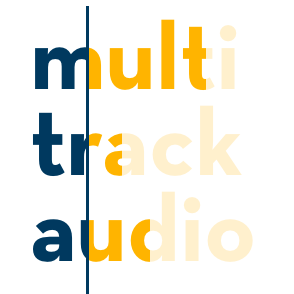

<p align="center">

</p>

# multitrack-audio-element

***NOTE: This repo is in a research/lab phase, and is not ready for use.***

A JavaScript (and HTML5) audio object that supports synchronized multitrack playback and streaming.

Feel free to edit this README freely!

## Developing

```sh
# Run tests
npm test

# Lint all the things
npm run lint

# Build ES5-friendly output
npm run build
```

-----

## Research

#### `MediaController` and `mediaGroup`

Several older articles and Q&A threads, as well as MDN, mention a `MediaController` object found at [`HTMLMediaElement.prototype.controller`](https://developer.mozilla.org/en-US/docs/Web/API/HTMLMediaElement) that could be used to control different media sources with the same `mediaGroup` attribute.

Firefox hasn't implement [any of them](https://bugzilla.mozilla.org/show_bug.cgi?id=847377), and Chromium has [unshipped it](https://groups.google.com/a/chromium.org/forum/#!topic/blink-dev/MVcoNSPs1UQ).

-----

#### `AudioTrackList` and `AudioTrack`

https://html.spec.whatwg.org/multipage/embedded-content.html#audiotracklist-and-videotracklist-objects

> An AudioTrackList object represents a dynamic list of zero or more audio tracks, of which zero or more can be enabled at a time. Each audio track is represented by an AudioTrack object.

Only implemented by Safari and IE (!). It allows for zero or more simultaneously activated tracks. The list of track `kind`s does not include a `"partial"`, `"instrument"` or anything similar:

* `"alternative"`
* `"captions"`
* `"descriptions"`
* `"main"`
* `"main-desc"`
* `"sign"`
* `"subtitles"`
* `"translation"`
* `"commentary"`
* `""`

-----

#### `AudioStreamTrack`

https://developer.mozilla.org/en-US/docs/Web/API/MediaStreamTrack

Part of the MediaStream API.


## Ideas and notes

* Could we accomplish the core functionality by just sharing an event system?
* Shimming `MediaController` and `mediaGroup` is one alternative

#### Possible extensions

* howler.js

-----

## Notes

### 2017-01-16

* Tricky to synchronize skipping ahead with mp3 sources (dash has solved this?)
* How to approach caching? - Save fetched audio so that one can skip back seamlessly
* Aurora.js for (demuxing and) decoding
* Streams?

#### What do we actually need?

* A developer creates a player from a list of tracks and their source URLs, and can then use an API with `load()`, `play(time)`, `seek(time)` etc.
* Any audio that is supported by `decodeAudio(ArrayBuffer)` should be decodable on the fly.
* The player acts as a lowest common denomenator event grouper that tells the developer when group of tracks needs buffering, when it's ready etc, just like a regular audio element.
* A player (code only, no UI) that stops playback when in buffering mode and resumes when a grouped `canplaythrough` event is triggered.

#### HTML tag example

```xml
<multitrack-audio>
  <track>
    <source src="track1.mp3" />
  </track>

  <tracks src="song.stems.mp4" />
</multitrack-audio>
```
